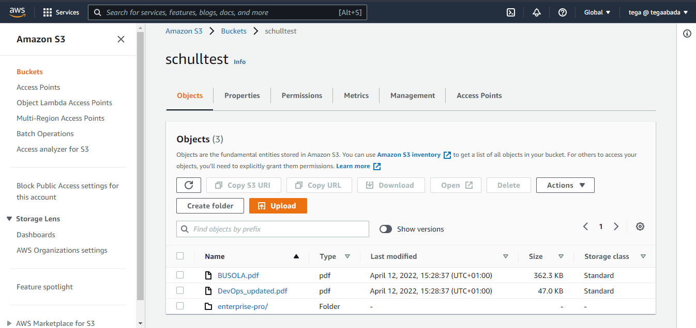

This Week lab will focus on getting you acquainted with Amazon S3 using the aws cli

# Task 1: Create a S3 bucket using AWS CLI

1. Lauch AWS cloud shell
2. Create a S3 bucket
3. Create a folder in your S3 bucket
4. Upload objects to your S3 bucket
5. List the object in your S3 bucket
6. Download Object from your S3 bucket
7. Delete object in your s3 bucket
8. Delete your S3 bucket

## S3 BUCKET LAB

1. S3 Bucket with objects.
   > Here is a screenshot of a list of S3 buskets created:

2. Objects were emtied and bucket permanently deleted.

For guide, kindly visit

https://docs.aws.amazon.com/cli/latest/reference/s3api/create-bucket.html

https://docs.aws.amazon.com/AmazonS3/latest/userguide/Welcome.html

https://docs.aws.amazon.com/cli/latest/userguide/cli-services-s3-commands.html
