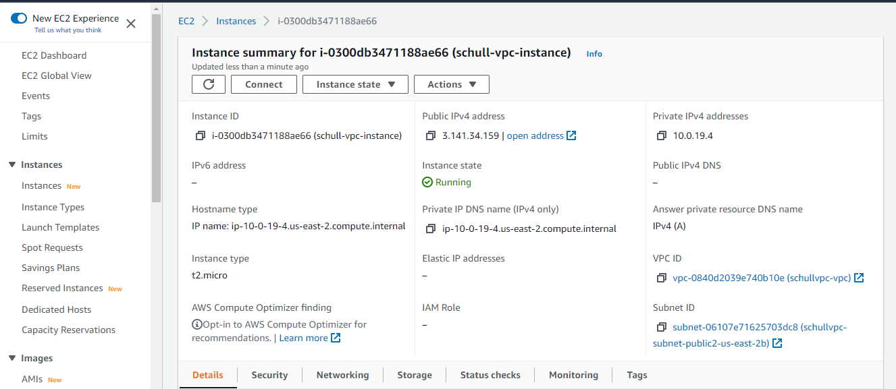

This task will get you acquainted on how to deploy VPC

Task 1: Deploy VPC using Management console

1. Launch the AWS Management Con sole
2. Launch a VPC with one public and one private subnets.
3. Create two route table and associate each one to each subnets
4. Attach an internet gateway to the VPC and a NAT gateway to the private subnet.
5. Lauch a Linux instance into this VPC and attach the subnet
6. Test the network connectivity
7. Perform clean up actions

### Notes

The VPC was launched with the AWS Console with a linux instance attched.

> Here is a screenshot of the Linux Instance summary launched with the VPC:



To test connectivity, ssh into the linux instance:

> input

```bash
 ssh -i "pirumkey.pem" ec2-user@3.141.34.159
```

> output

```bash
 Last login: Thu Apr 14 21:18:54 2022 from 197.211.61.44

       __|  __|_  )
       _|  (     /   Amazon Linux 2 AMI
      ___|\___|___|


```

For guide, you are check the links below:

https://docs.aws.amazon.com/cli/latest/reference/ec2/

https://docs.aws.amazon.com/cli/latest/reference/ec2/describe-vpcs.html
